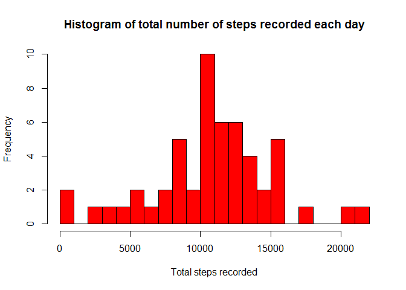
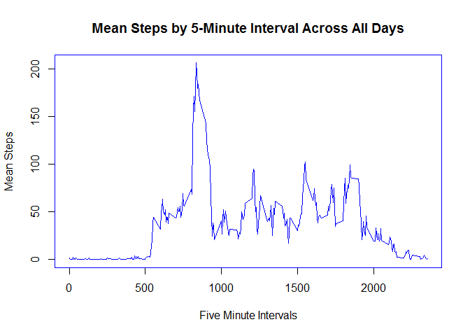
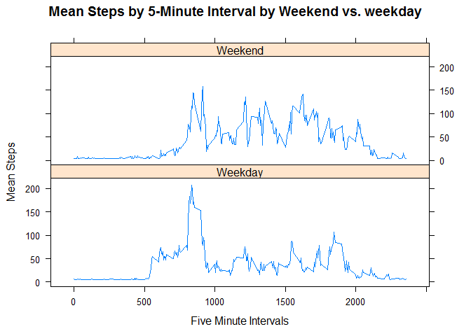

# Reproducible Research: Peer Assessment 1
##### Please note that:
##### 1. The dataset required for this assignment ("activity.zip") is in the GitHub repository
##### 2. All r code to create this report is shown as code chunks aligned to each assignment question using "knitr" with echo=TRUE so there is no processing going on behind the scenes

## Loading and preprocessing the data

```r
# 1. Load the data
activity_data <- read.csv(
        unz("activity.zip", "activity.csv"), 
        header=TRUE)

# 2. Process/transform data into a suitable format for this analysis

# Change date column from character to a date field

activity_data$date <- as.POSIXct(activity_data$date, 
        format="%Y-%m-%d")
```

## What is mean total number of steps taken per day?

```r
# Ignoring NA values
# 1. Calculate the total number of steps per day
steps_day <- aggregate(steps ~ date,
        activity_data,
        FUN=sum, 
        na.rm=TRUE)

# and give proper column names
names(steps_day) <- c("date", "steps")

# 2. Make a histogram of the total number of steps taken per day 
hist(steps_day$steps, 
        breaks=25,
        col="red", 
        xlab="Total steps recorded", 
        main="Histogram of total number of steps recorded each day")
```

 

```r
# 3. Calculate and report the mean and median
mean(steps_day$steps)
```

```
## [1] 10766.19
```

```r
median(steps_day$steps)
```

```
## [1] 10765
```

## What is the average daily activity pattern?

```r
# 1. Make a time series of the 5-minute interval (x-axis) and the average number of steps
#    taken, averaged across all days (y-axis)
steps_interval <- aggregate(steps ~ interval, 
        activity_data,
        FUN=mean, 
        na.rm=TRUE)

# and give proper column names
names(steps_interval) <- c("interval", "mean_steps")

# now make the time series plot with type=l of the 5 minutes intervals
par(col="blue")
plot(x = steps_interval$interval,
        y = steps_interval$mean_steps,
        type = "l",
        main = "Mean Steps by 5-Minute Interval Across All Days",
        xlab = "Five Minute Intervals",
        ylab = "Mean Steps")
```

 

```r
# 2. Which 5-minute interval, on average across all days in the dataset, 
#    contains the maximum number of steps?
steps_interval[steps_interval$mean_steps==max(steps_interval$mean_steps), ]
```

```
##     interval mean_steps
## 104      835   206.1698
```

## Inputing missing values

```r
# 1. Calculate and report the total number of missing values (NAs) in the dataset
nrow(activity_data) - sum(complete.cases(activity_data))
```

```
## [1] 2304
```

```r
# 2. Devise a strategy for filling the missing values in the dataset

# I have chosen to  replace NA values using the mean of that 5 minute interval
new_activity_data <- merge(activity_data, steps_interval, 
        by = 'interval')

new_activity_data$steps[is.na(new_activity_data$steps)] <- 
        as.integer(mean(new_activity_data$mean_steps, na.rm=TRUE))

# finally repeat calculation of missing values to prove they're all gone
nrow(new_activity_data) - sum(complete.cases(new_activity_data))
```

```
## [1] 0
```

## Are there differences in activity patterns between weekdays and weekends?

```r
# 1. Create a new factor variable in the dataset with two levels - Weekday and weekend
#    indicating whether a given date is a weekday or weekend day

# First add day names
new_activity_data <- cbind(new_activity_data, 
        day = weekdays(new_activity_data$date))

# Now add variable 'day_type' and set to weekday or weekend based on day name
new_activity_data <- cbind(new_activity_data, 
        day_type = ifelse(
                new_activity_data$day == "Saturday" | new_activity_data$day == "Sunday", 
                "Weekend", "Weekday")
        )

# Now aggregate by mean of steps by interval
by_intervals <- aggregate(steps ~ interval + day_type, 
        new_activity_data, 
        FUN = mean)

# 2. Make a panel plot containing a time series plot of the 5-minute intervals (x-axis)
#    and the average number of steps taken averaged across weekdays and weekend 
#    days (y-axis)
library(lattice)
xyplot(steps ~ interval | day_type,
        data = by_intervals,
        type = "l",
        layout = c(1,2),
        main = "Mean Steps by 5-Minute Interval by Weekend vs. weekday",
        xlab = "Five Minute Intervals",
        ylab = "Mean Steps")
```

 
